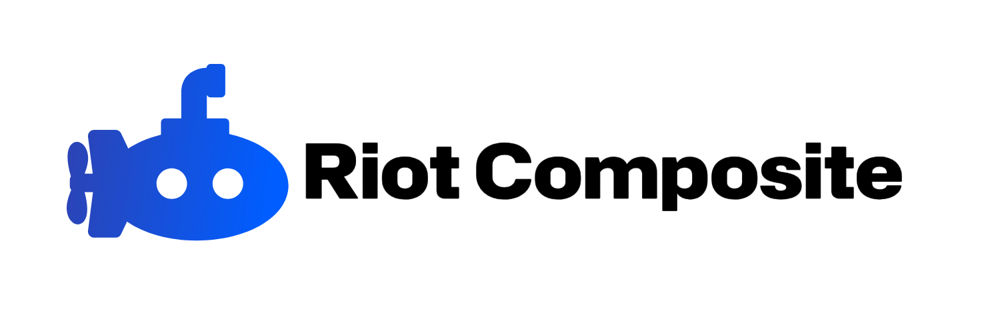

# Riot Composite

Riot Composite is a UI Framework for providing modern, clean components and styles to our products. This organization contains the source code of the documentation, libraries, and the source code of the project.

## Starting

Start contributing reading the following rules and guidelines to maintain a safe, lovely community.

 1) Don't leak, threaten to leak anyone personal information ("doxxing").

 2) Be respectful with everyone, including the contributors, community and owners of the organization.

 3) Follow the rules (e.g. Code of Conduct, Contributing) before submitting a pull-request.
